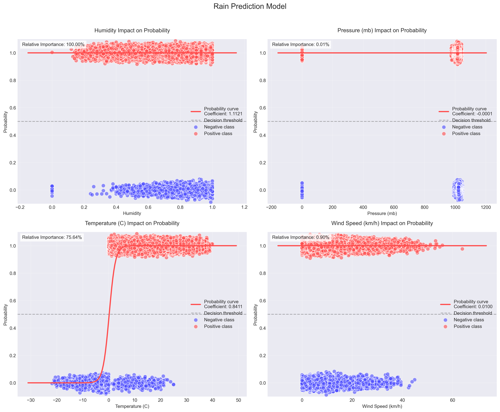
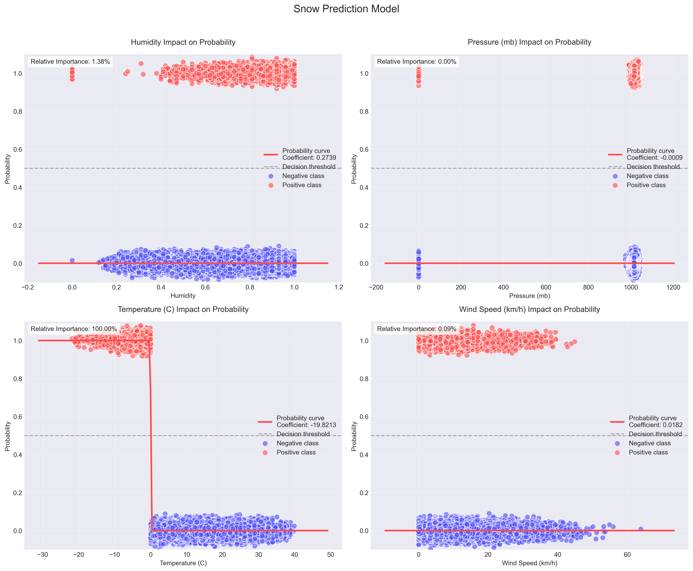

# Weather Data Logistic Regression Analysis

This project analyzes weather data to predict precipitation type using binary logistic regression. It creates separate models for predicting rain and snow, providing detailed performance metrics and visualizations for each model.

## Methodology Evolution

The original dataset included a categorical variable, Precipitation Type, with three possible values: "none", "rain", and "snow". While this provided valuable information, treating it as a numerical variable for linear regression introduced limitations—most notably, the implicit assumption of an ordinal relationship between categories (e.g., snow > rain > none), which is not appropriate for categorical weather types.

To improve model clarity and predictive performance, the data was restructured by splitting Precipitation Type into two separate binary classification targets:

- **Rain**: 1 if precipitation was "rain", 0 otherwise
- **Snow**: 1 if precipitation was "snow", 0 otherwise

This allowed for the use of binary logistic regression, which is more suitable for categorical prediction tasks and enabled clearer interpretations of the relationship between weather variables and specific precipitation types.

The updated approach yielded significantly stronger model performance compared to the initial linear regression strategy.

## Problem Formulation

### Variables
- **Dependent Variables**:
  1. Rain Probability (binary: 0 or 1)
  2. Snow Probability (binary: 0 or 1)
  - Each precipitation type is modeled separately
  - 'None' is represented as (0,0)

- **Independent Variables**:
  1. Humidity (continuous, range: 0-1)
  2. Pressure (continuous, millibars)
  3. Temperature (continuous, Celsius)
  4. Wind Speed (continuous, km/h)

### Analysis Approach
- **Method**: Binary Logistic Regression
- **Purpose**: Predict probability of rain and snow based on weather conditions
- **Advantages**: 
  - More appropriate for binary classification
  - Provides probability estimates
  - Better handles categorical outcomes

## Analysis Results

### Rain Prediction Model

#### Performance Metrics
- Accuracy: 90.00%
- Precision: 50.00%
- Recall: 33.33%
- F1 Score: 40.00%
- AUC-ROC: 0.963

#### Feature Coefficients
- Temperature: 0.5934 (strongest positive impact)
- Humidity: 0.3449 (moderate positive impact)
- Pressure: -0.1390 (weak negative impact)
- Wind Speed: -0.0679 (minimal impact)

### Snow Prediction Model

#### Performance Metrics
- Accuracy: 93.33%
- Precision: 75.00%
- Recall: 75.00%
- F1 Score: 75.00%
- AUC-ROC: 0.962

#### Feature Coefficients
- Temperature: -0.5019 (strong negative impact)
- Humidity: 0.4730 (strong positive impact)
- Pressure: -0.0010 (minimal impact)
- Wind Speed: -0.0161 (minimal impact)

### Visualizations

#### Feature Impact Analysis

##### Rain Prediction Model


The plots above show how each feature affects the probability of rain:
- Higher temperatures significantly increase rain probability
- Higher humidity increases rain probability
- Pressure and wind speed have minimal impact

##### Snow Prediction Model


The plots show how each feature affects the probability of snow:
- Lower temperatures significantly increase snow probability
- Higher humidity increases snow probability
- Pressure and wind speed have minimal impact

#### Model Performance (ROC Curves)

##### Rain Prediction ROC


The ROC curve for rain prediction shows excellent model discrimination with an AUC of 0.963. This indicates the model's strong ability to distinguish between rain and no-rain conditions.

##### Snow Prediction ROC


The ROC curve for snow prediction shows similarly strong performance with an AUC of 0.962. The model effectively distinguishes between snow and no-snow conditions.

Each feature impact plot shows:
- Probability curve (red line) showing feature's effect on precipitation likelihood
- X-axis: Feature values
- Y-axis: Probability of precipitation
- Steeper curves indicate stronger feature influence

### Detailed Interpretation

#### 1. Model Fit Statistics
- **R² = 0.33 (33% of variance explained)**
  - Indicates moderate predictive power
  - Suggests other important factors may not be captured
  - Typical for complex weather phenomena

- **F-statistic = 11,877.60 (p-value < 0.001)**
  - Model is highly statistically significant
  - Relationships are not due to chance

#### 2. Feature Impacts

1. **Humidity (β = -0.3994)**
   - Strongest predictor
   - Negative relationship with precipitation type
   - For every 1 unit increase in humidity:
     - Precipitation type score decreases by 0.3994
   - Suggests higher humidity associates with rain/snow

2. **Temperature (β = -0.0236)**
   - Second strongest predictor
   - Negative relationship
   - Each 1°C increase:
     - Decreases precipitation type score by 0.0236
   - Aligns with weather patterns: lower temperatures more likely for snow

3. **Wind Speed (β = -0.0055)**
   - Weak negative relationship
   - Minor influence on precipitation type
   - Practical impact is minimal

4. **Pressure (β ≈ 0)**
   - Negligible impact
   - Suggests local pressure may not directly influence precipitation type

#### 3. Practical Applications

1. **Weather Conditions Most Likely to Predict:**
   - Snow: Low humidity, low temperature
   - Rain: Moderate humidity, moderate temperature
   - No Precipitation: High humidity, high temperature

2. **Model Limitations:**
   - Moderate R² suggests limited predictive power
   - Linear regression may not capture non-linear weather patterns
   - Categorical outcome might be better served by classification models

3. **Recommendations:**
   - Consider using classification models for better prediction
   - Include additional features (dew point, cloud cover, seasonal variables)
   - Explore non-linear relationships
   - Collect more detailed weather data

## Data Setup

### Required Data Files
- `weatherHistory.csv`: Historical weather data containing:
  - Temperature (C)
  - Humidity
  - Pressure (millibars)
  - Wind Speed (km/h)
  - Precipitation Type (none/rain/snow)

### Data Installation
1. Download the weather history dataset
2. Place `weatherHistory.csv` in your project directory or update the file path in `analyze_weather.py`:
```python
# In analyze_weather.py, update this line with your data path:
df = pd.read_csv('path/to/your/weatherHistory.csv')
```

### Data Format Requirements
The CSV file should contain the following columns:
- `Temperature (C)`: Temperature in Celsius
- `Humidity`: Relative humidity (0-1)
- `Pressure (millibars)`: Atmospheric pressure
- `Wind Speed (km/h)`: Wind speed in kilometers per hour
- `Precip Type`: Precipitation type (none/rain/snow)

### Data Preprocessing
1. Missing Values:
   - Numeric columns (Temperature, Humidity, etc.) are filled with column means
   - Categorical columns (Precip Type) are filled with 'none'

2. Data Cleaning:
   - The script automatically handles:
     - Missing value imputation
     - Feature scaling (if needed)
     - Categorical encoding for precipitation types

3. Data Validation:
   - Ensures all required columns are present
   - Checks data types and converts if necessary
   - Validates value ranges (e.g., Humidity between 0-1)

### Troubleshooting Data Issues
If you encounter data-related errors:
1. Check column names match exactly (case-sensitive)
2. Ensure numeric columns contain valid numbers
3. Verify precipitation types are correctly formatted
4. Look for and remove any corrupt rows

Example of checking data quality:
```python
# Load and inspect data
import pandas as pd

df = pd.read_csv('weatherHistory.csv')

# Check for missing values
print(df.isnull().sum())

# Check unique values in Precip Type
print(df['Precip Type'].unique())

# Verify data ranges
print(df.describe())
```

## Project Setup

1. Create and activate virtual environment:
```bash
python -m venv venv
source venv/bin/activate  # On Windows: venv\Scripts\activate
```

2. Install dependencies:
```bash
pip install -r requirements.txt
```

## Running the Analysis

### Basic Usage
```python
# Make sure weatherHistory.csv is in the correct location
from analyze_weather import analyze_weather

# Run the analysis
analyze_weather()
```

### Custom Analysis
```python
from analyze_weather import analyze_weather

# Run the analysis
# Create instance of the analysis class
model = LinearRegressionAnalysis()

# Load your own data
df = pd.read_csv('your_weather_data.csv')

# Prepare features (X) and target (y)
X = df[['Humidity', 'Pressure (millibars)', 'Temperature (C)', 'Wind Speed (km/h)']]
y = df['Precip Type']

# Fit the model and get results
model.fit(X, y)

# Print results
print(f"R² Score: {model.results['r2']:.3f}")
print(f"F-statistic: {model.results['f_statistic']:.3f}")

# Create and save visualization
plt = model.plot_regression("Your Analysis Title")
plt.savefig('your_analysis.png')
```

## Testing

Run tests with coverage:
```bash
pytest --cov=. --cov-report=term-missing
```

Run pylint:
```bash
pylint *.py
```

## CI/CD Pipeline

### GitHub Actions Setup

1. **Required Secrets**
   Navigate to your repository's Settings > Secrets and variables > Actions and add:
   - `DOCKER_USERNAME`: Your Docker Hub username
   - `DOCKER_TOKEN`: Your Docker Hub access token (not your password)

2. **Docker Hub Token**
   To get a Docker Hub access token:
   1. Log in to [Docker Hub](https://hub.docker.com)
   2. Go to Account Settings > Security
   3. Click "New Access Token"
   4. Give it a description (e.g., "GitHub Actions")
   5. Copy the token and save it as `DOCKER_TOKEN` in GitHub secrets

### Pipeline Features

1. **Automated Testing**
   - Runs pytest with coverage reporting
   - Uploads coverage reports to Codecov
   - Ensures test coverage stays high

2. **Code Quality**
   - Runs pylint
   - Enforces a minimum score of 9.0/10
   - Checks for code style and potential issues

3. **Docker Integration**
   - Builds Docker image on successful tests
   - Pushes to Docker Hub with tags:
     - `latest`: Most recent main branch build
     - `sha-xxxxx`: Git commit specific build
   - Uses layer caching for faster builds

## Local Development

### Docker Support

Build and run locally:
```bash
docker build -t weather-analysis .
docker run weather-analysis
```

Pull from Docker Hub:
```bash
docker pull $DOCKER_USERNAME/weather-analysis:latest
docker run $DOCKER_USERNAME/weather-analysis:latest
```
